# HackerRank_SQL_Advanced_Joins

## Purpose

This repository contains the solutions of HackerRank SQL queries on Advanced Joins.

## Source

- HackerRank

## Advanced Joins Problems & Solutions

### Problem 1:

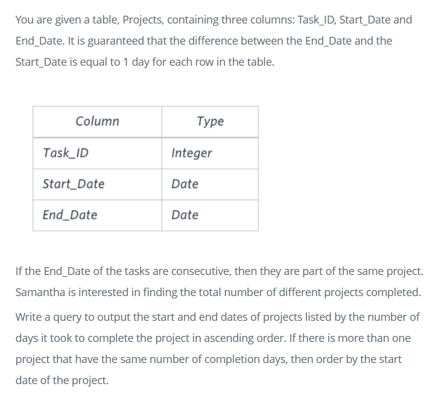
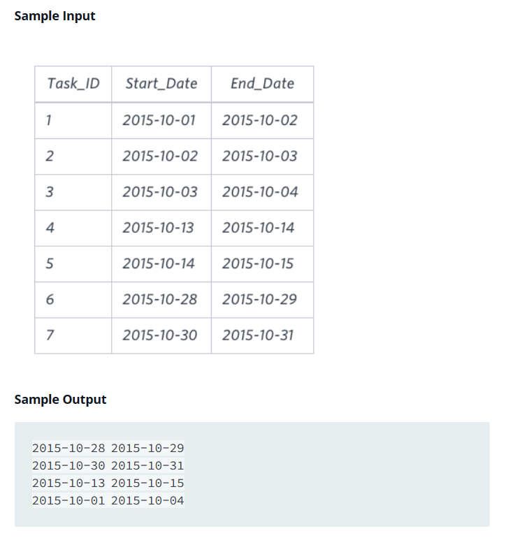

### Solution:

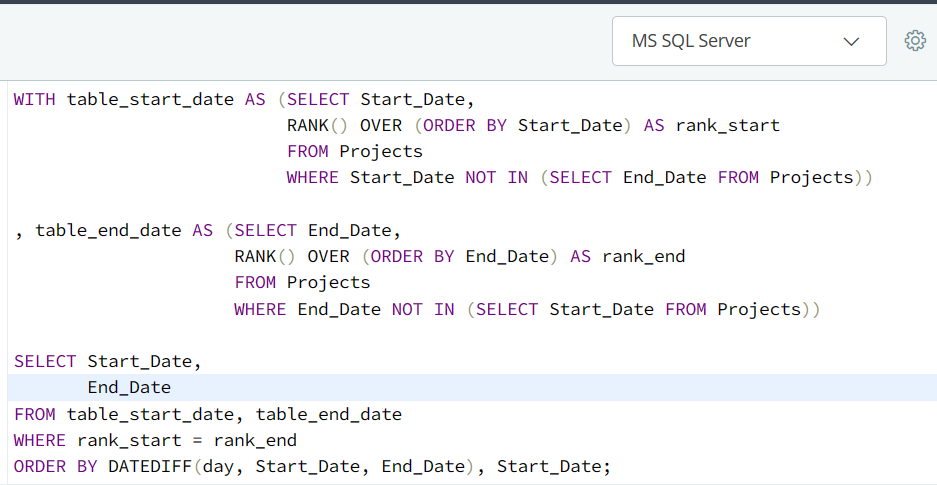

### Problem 2:

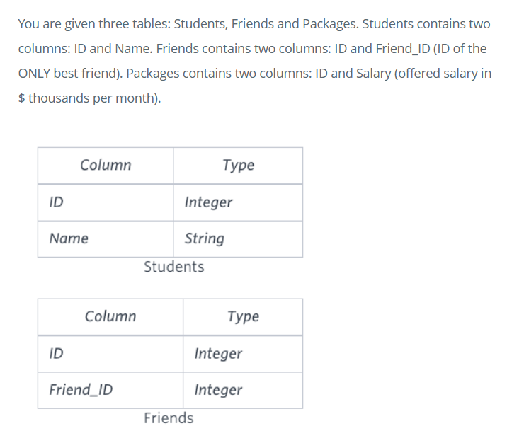
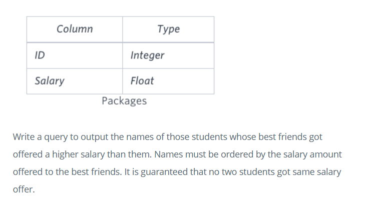

### Solution:

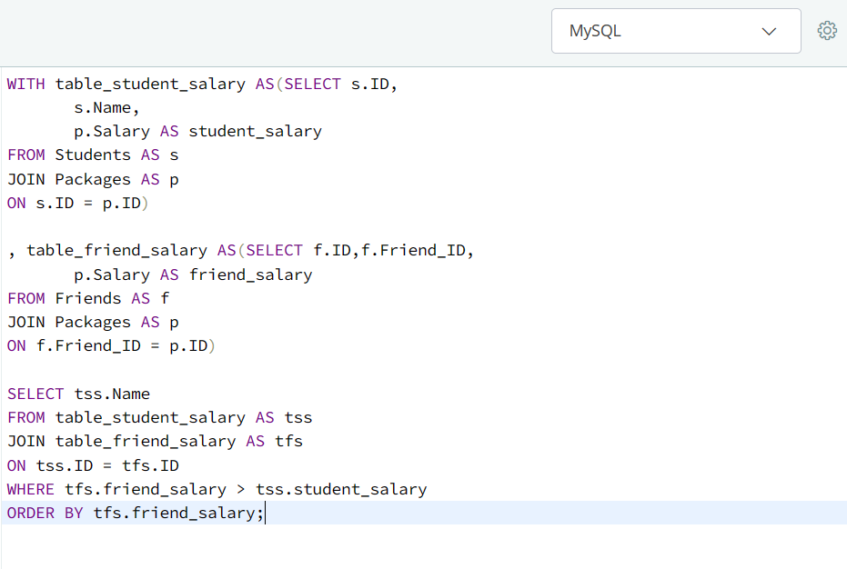

### Problem 3:

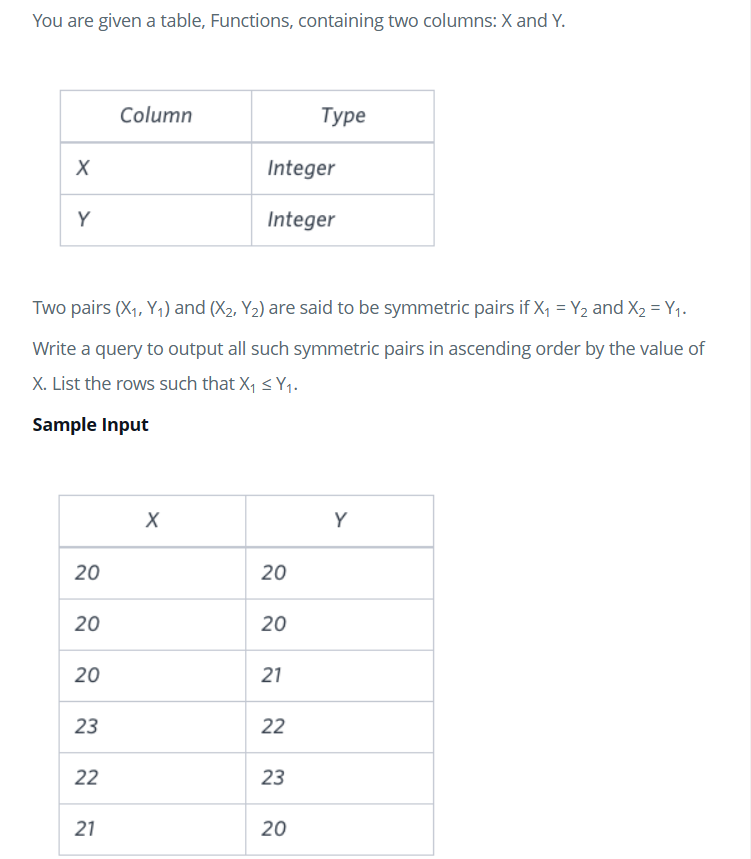

### Solution 1:

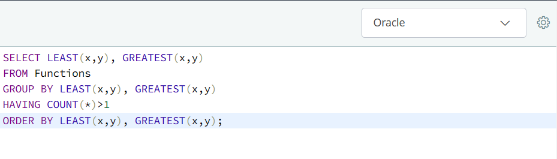

#### OR Solution 2:

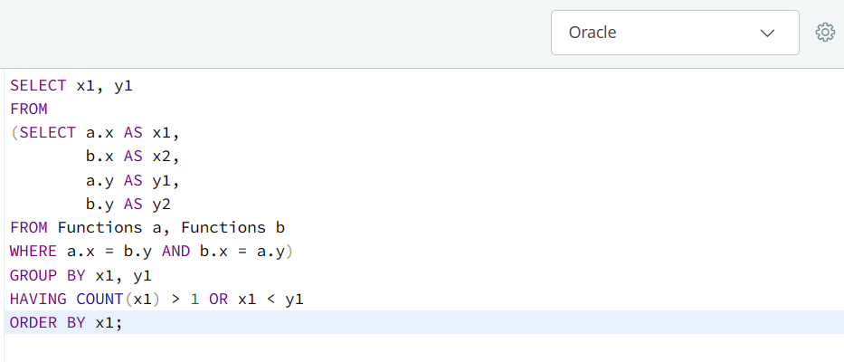

### Problem 4:

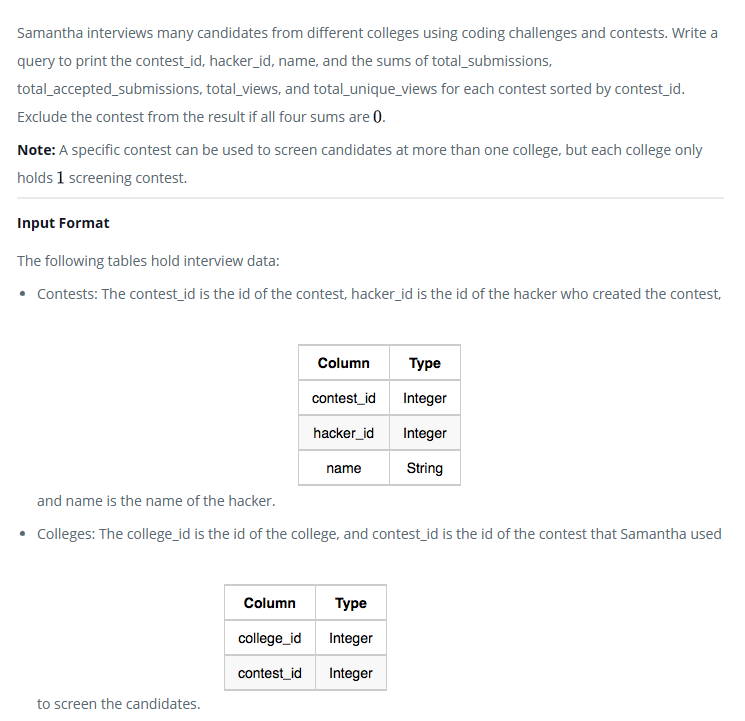
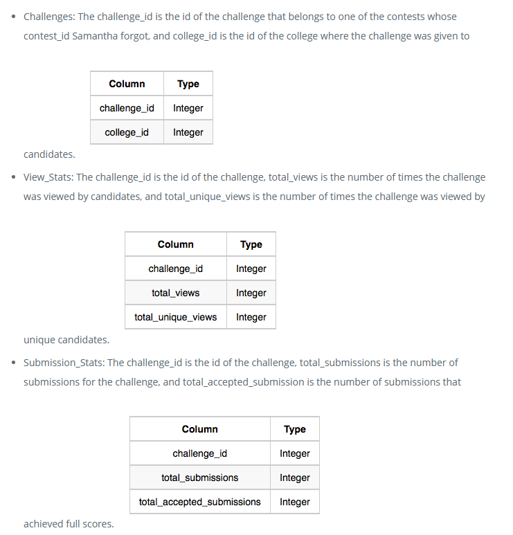

### Solution:

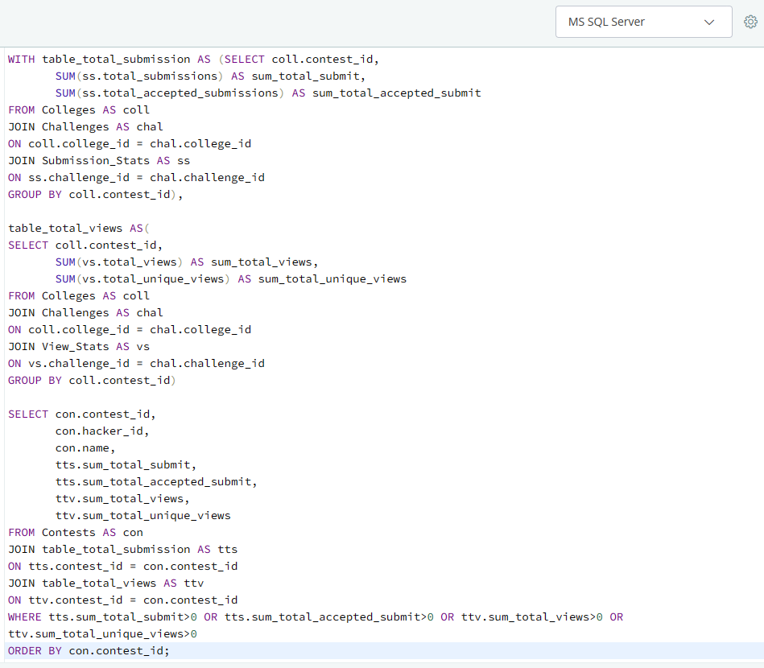

### Problem 5:

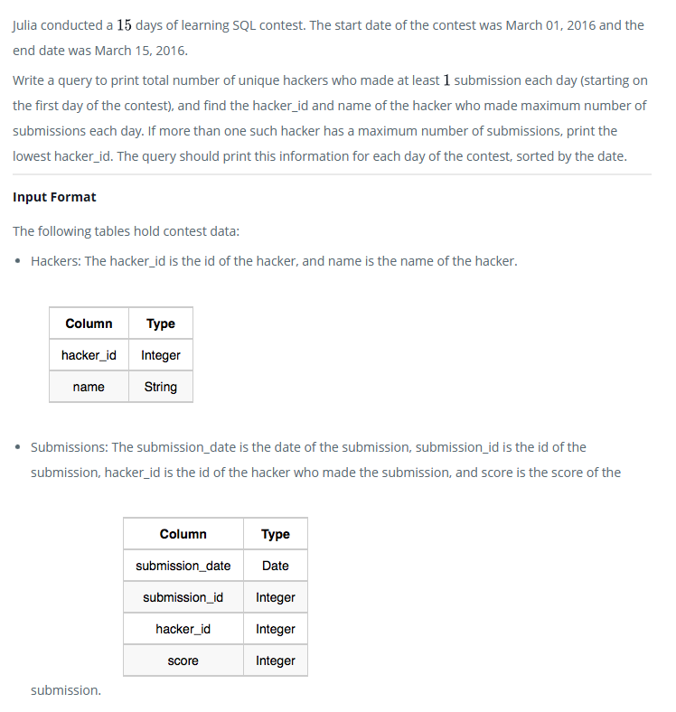

### Solution:

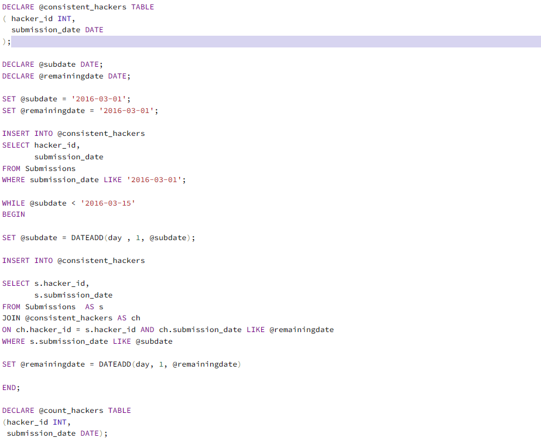
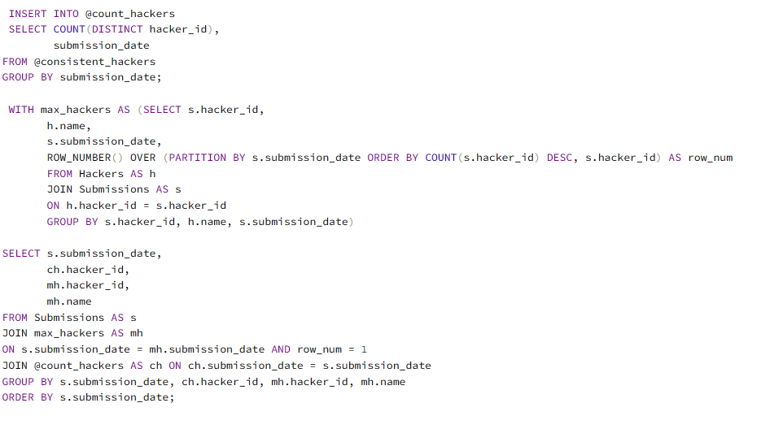
